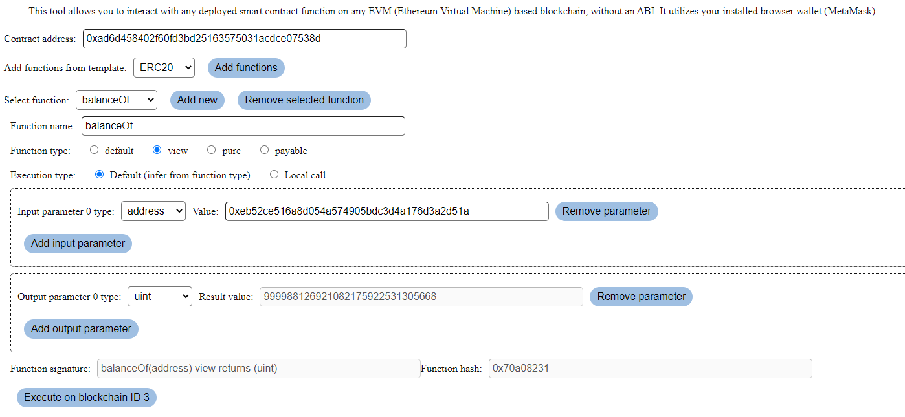

# EVM Connector

This is a tool for interacting with arbitrary contracts on any EVM
(Ethereum Virtual Machine) based blockchain, with or without an ABI. Defined
contracts can be shared via URL, so this can be utilized as a contract
dashboard. The tool utilizes your installed browser wallet (MetaMask).

EVM-based blockchains are for example:

<ul>
    <li>Ethereum</li>
    <li>Binance Smart Chain</li>
    <li>Tron</li>
    <li>Layer 2 / sidechain solutions, such as Optimism</li>
</ul>

## Web app

The app is deployed at https://evmconnector.dev .



<i>An example where the tool is used to check the ERC20 balance of an address</i>

## Functionality

### Importing functions

You can import functions either with an ABI or from a known contract standard (such as ERC-20). The tool will tell you if the import succeeded. Notes about the import:

1. Not all legacy ABI formats are supported
1. Not all parameter types are (yet) supported. Only functions with supported parameter types will be imported.

### Defining function parameters

Each function has zero or more input and output parameters. Input parameters are data you input to the function. Output parameters are data that comes out of the function, once it's executed. Both of these are part of the function signature.

Defining function parameters:

1. Add a new input or output parameter, depending on which one you want to define
1. Select its `base type`
1. If you need to define the type further, click *Details*
1. Choose the desired parameter type definitions in the details view
1. If this is an input function, add input value(s) for it

You can always check the function signature to see if your function definition looks correct.

### Chosen network

The blockchain network to use is determined by your browser wallet.

### Function interaction

In order to interact with a function, at least the following need to be correctly configured:

1. Your browser wallet connected to the correct network
1. Contract address
1. Function name
1. If the function has input parameters, define their types and values

### Share contract definition

Once you have defined a contract with functions, you can share the interaction page with others via a URL. You can generate a URL for any contract you have defined in this tool and other will be able to access the same contract functionality via the URL. Click the "Generate shareable URL" button to generate a contract URL.

Sharing a contract through URL includes the following information:

- Contract address
- Contract functions:
  - Name of the function
  - Function type
  - Function input and output parameters without values

Once another user opens the site through such contract URL, the data is populated for him. In order to interact with the contract, the user needs to:

1. Connect his wallet and connect to the correct network
1. Choose which function he wants to interact with
1. Enter needed input values for the possible input parameters
1. Execute the function

## Possible questions

This tool is mostly meant for developers who know what they are doing. Anyway, here are answers to some of the most obvious questions:

<p>Q: What is the "default" function type? A: It means there is no explicit function type specified in the function signature. It implies a "nonpayable" function which can do state changes but has no special properties. </p>

<p>Q: Why can't I sometimes see the result of the function execution? A: There is no way to get function result data if the call is in a real transaction.</p>

<p>Q: Why is there an option to specify the execution type? A: Normally you can just leave this to be the default value.But if you need, for example, the return value from a state-changing function, you can change this to "Local call" to simulate calling the function as type `view` even if really isn't a `view` function. This way you can get the resulting data (although no state changes are performed).</p>

## Future development

Some future development is considered and issues are created for those this repo. Please feel free to leave feedback!

# Technical stuff

## Tecnical notes

- There is no backend. There is only the frontend you see
- There is no external web3 connection. The only connection to the blockchain is through your wallet
- No cookies or other persistent storage is utilized. This also means no tracking of any kind
- Considering the above facts, it's rather difficult to abuse the system, since you can only hurt your own browser and/or the node your wallet uses.

## Technologies used

- Node v14.15
- Solidity 0.7.5 (only for some local testing)
- Hardhat
- Ethers.js
- ReactJS
- TypeScript
- ESLint / Prettier

## Instructions

### Required components

Make sure you have `yarn` installed.

You can run the project fully locally with the following instructions.

To run local blockchain:

```
yarn run localchain
```

To deploy the example contract locally:

```
yarn run deploy-local
```

To run the frontend locally:

```
yarn run serve-frontend
```

# Contact

If you have any questions or comments, feel free to poke me at http://t .me/Lauri_P . Hope you find the tool useful!
