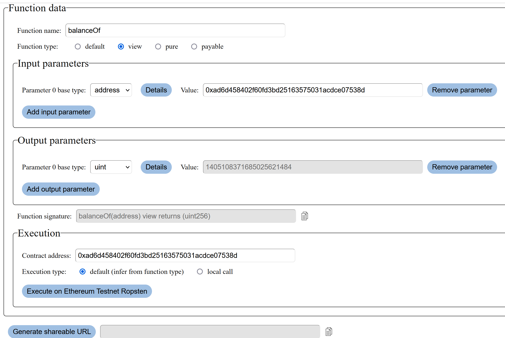

# EVM Connector

This tool allows you to interact with any deployed smart contract function on any EVM (Ethereum Virtual Machine) based blockchain, without an ABI. It utilizes your installed browser wallet (MetaMask).

EVM-based blockchains are for example:
<ul>
    <li>Ethereum</li>
    <li>Binance Smart Chain</li>
    <li>Tron</li>
    <li>Layer 2 / sidechain solutions, such as Optimism</li>
</ul>

## Web app

The app is deployed at https://evmconnector.dev



<i>An example where the tool is used to check the balance of an address</i>

## Functionality

This tool is meant to be used if you know a function you want to interact with, but don't have the tools nor the ABI to interact with the function in more conventional ways.

### Chosen network

The blockchain network to use is determined by your browser wallet. Its chainId (https://chainlist.org/) is displayed in the "Execute" button.

### Defining function

You can either choose a predefined function template, or define your own function with the option "Input manually".

If you choose to define your function manually, you have to at least define "function name" and "contract address". If you choose a predefined function template, you only need to enter the contract address and possible input values.

### Possible questions

This tool is mostly meant for developers who know what they are doing. Anyway, here are answers to some of the most obvious questions:

<p>Q: What is the "default" function type? A: It means there is no explicit function type specified in the function signature. It implies a "nonpayable" function which can do state changes but has no special properties. </p>

<p>Q: Why can't I sometimes see the result of the function execution? A: There is no way to get function result data if the call is in a real transaction.</p>

<p>Q: Why is there an option to specify the execution type? A: Normally you can just leave this to be the default value.But if you need, for example, the return value from a state-changing function, you can change this to "Local call" to simulate calling the function as type `view` even if really isn't a `view` function. This way you can get the resulting data (although no state changes are performed).</p>

### Future development

Some future development is considered and issues are created for those this repo. Please feel free to leave feedback!

## Technical stuff

### Technologies used

* Node v14.15
* Solidity 0.7.5 (only for some local testing)
* Hardhat
* Ethers.js
* ReactJS
* TypeScript
* ESLint / Prettier

### Instructions

You can run the project fully locally with the following instructions.

To run local blockchain:

```
npm run localchain
```

To deploy the example contract locally:
```
npm run deploy-local
```

To run the frontend locally:
```
npm run serve-frontend
```

## Contact

If you have any questions or comments, feel free to poke me at http://t .me/Lauri_P . Hope you find the tool useful!
